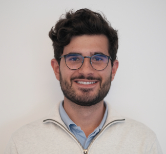

## About Me

Hi! I am a PhD student at the [Faculty of Sciences of the University of Lisbon](https://ciencias.ulisboa.pt/) (FCUL), conducting research at [LASIGE](https://www.lasige.pt/). I am supervised by [Professor Sara Madeira](https://saracmadeira.wordpress.com/) from FCUL and [Professor Piero Fariselli](http://www.biocomp.unibo.it/piero/) from the [Department of Medical Sciences of the University of Turin](https://dms.campusnet.unito.it/do/home.pl).

My current research focuses on improving neurodegenerative disease prognosis, with special attention to ALS and MS, using Deep Learning. I am especially interested in learning whether these Deep Learning solutions are also robust and trustworthy ([here's a paper related to that](https://aclanthology.org/2021.emnlp-main.113/)).

I am interested in Deep Learning as a field overall and its applicability to a multitude of problems. I have conducted research in Natural Language Processing previously, at the [NLX-Group](http://nlx.di.fc.ul.pt/). My [Msc Dissertation](https://github.com/nlx-group/study-of-commonsense-reasoning), supervised by [Professor António Branco](http://www.di.fc.ul.pt/~ahb/) to obtain a Masters in Data Science, focused on a particular problem named [Shortcut Learning](https://www.nature.com/articles/s42256-020-00257-z), specifically when learning commonsense reasoning.

For a more thorough and structured description of my work, you may check [my CV](https://drive.google.com/file/d/1IkYwV90qBOrX6z_5EVxYhzMBOBnBBZLO/view).

Links:
  <a href="https://scholar.google.pt/citations?user=7nC30zwAAAAJ"><i class="fas fa-graduation-cap"></i></a> ⚭
  <a href="https://orcid.org/0000-0002-8126-8513"><i class="fab fa-orcid"></i></a> ⚭
  <a href="https://github.com/RubenBranco/"><i class="fab fa-github"></i></a> ⚭
  <a href="https://www.linkedin.com/in/ruben-branco-2141641a1/"><i class="fab fa-linkedin"></i></a>

## Research Interests

I am interested in many topics beyond these (like Physics, Psychology, etc.) and am always looking forward for collaborations (given the time). If you have a problem you would like to collaborate on, feel free to [contact me](#contact).

* Deep Learning
* Natural Language Processing
* Bioinformatics
* Cognition

## Teaching

## 2021/2022

### Advanced Machine Learning, Faculty of Sciences of the University of Lisbon

Teaching Theoretical-Practical classes, offered to all Department of Informatics Masters' Programs in the 2nd Semester.

Class focuses on more advanced topics such as Ensemble Learning, Markov Models, Deep Learning

### Machine Learning, Faculty of Sciences of the University of Lisbon

Taught Theoretical-Practical classes, offered to 8 Masters Programs and 1 PhD Program in the 1st Semester.

Class focuses on Supervised & Unsupervised Learning fundamentals.

## Publications

1. Branco, Ruben, António Branco, João Silva and António Rodrigues, 2021, "Shortcutted Commonsense: Data Spuriousness in Deep Learning of Commonsense Reasoning", In Proceedings of the 2021 Conference on Empirical Methods in Natural Language Processing (EMNLP).
2. Branco, Ruben, António Branco, João Silva and António Rodrigues, 2021, "Commonsense Reasoning: how do Neuro-only and hybrid Neuro-Symbolic approaches compare?", In Proceedings of the CIKM 2021 Workshops.
3. Branco, António, João Rodrigues, Malgorzata Salawa, Ruben Branco and Chakaveh Saedi, 2020, "Comparative Probing of Lexical Semantics Theories for Cognitive Plausibility and Technological Usefulness", In Proceedings of the 28th International Conference on Computational Linguistics. doi: 10.18653/v1/2020.coling-main.354
4. Lima, Beatriz, Ruben Branco, João Castanheira, Gustavo Fonseca and Catia Pesquita, 2020, "Learning reference alignments for ontology matching within and across domains", In OM@ISWC. 2020.
5. Rodrigues, João, Ruben Branco, João Silva and António Branco, 2020, "Reproduction and Revival of the Argument Reasoning Comprehension Task", In Proceedings, 12th Language Resources and Evaluation Conference (LREC2020), European Language Resources Association, Marseílle, France, 13-15 May 2020.
6. Branco, António, Sara Grilo, Márcia Bolrinha, Chakaveh Saedi, Ruben Branco, João Silva, Andreia Querido, Rita de Carvalho, Rosa Gaudio, Mariana Avelãs and Clara Pinto, 2020, "The MWN.PT WordNet for Portuguese: Projection, Validation, Cross-lingual Alignment and Distribution", In Proceedings, 12th Language Resources and Evaluation Conference (LREC2020), European Language Resources Association, Marseílle, France, 13-15 May 2020.
7. Etchegoyhen, Thierry, Borja Porras, [and 20 others, including Ruben Branco], 2020, "ELRI: A Decentralised Network of National Relay Stations to Collect, Prepare and Share Language Resources", in Proceedings of the 1st International Workshop on Language Technology Platforms, European Language Resources Association, Maseílle, France, May 2020.
8. Salawa, Małgorzata, António Branco, Ruben Branco, João Rodrigues and Chakaveh Saedi, 2019, "Whom to Learn From? Graph- vs. Text-based Word Embeddings", In Proceedings of the International Conference Recent Advances in Natural Language Processing, RANLP 2019. doi: 10.26615/978-954-452-056-4_120
9. Branco, Ruben, João Rodrigues, Chakaveh Saedi and António Branco, 2019, "Assessing Wordnets with WordNet Embeddings", In Proceedings, 10th Global WordNet Conference (GWC2019), Poland, 23-27 July 2019.
10. Gomes, Luís, Frederico Apolónia, Ruben Branco, João Ricardo Silva, António Branco, 2018, "Setting up the PORTULAN / CLARIN repository", In Proceedings, CLARIN Annual Conference (CLARIN2018), Pisa, 9 October 2018, pp.108-111.
11. Rodrigues, João António, Ruben Branco, João Silva, Chakaveh Saedi, António Branco, 2018, "Predicting Brain Activation with WordNet Embeddings", In Proceedings, 56th Annual Meeting of the Association for Computational Linguistics (ACL2018), Workshop on Cognitive Aspects of Computational Language Learning and Processing (CogACLL), Melbourne, 19 July 2018. doi: 10.18653/v1/W18-2801
12. Etchegoyhen, Thierry, Borja Porras, [and 18 others, including Ruben Branco], 2018, "ELRI. European Language Resource Infrastructure", In Proceedings of the 21st Annual Conference of the European Association for Machine Translation, Alicante, Spain, 28-30 May 2018.
13. Branco, António, Ruben Branco, Chakaveh Saedi and João Silva 2018, "Browsing and Supporting Pluricentric Global Wordnet, or just your Wordnet of Interest", In Proceedings, 11th Language Resources and Evaluation Conference (LREC2018), European Language Resources Association, Myazaki, Japan, 9-11 May 2018, pp. 4562-4569.

## Contact

You can contact me at: rmbranco [at] ciencias.ulisboa.pt
